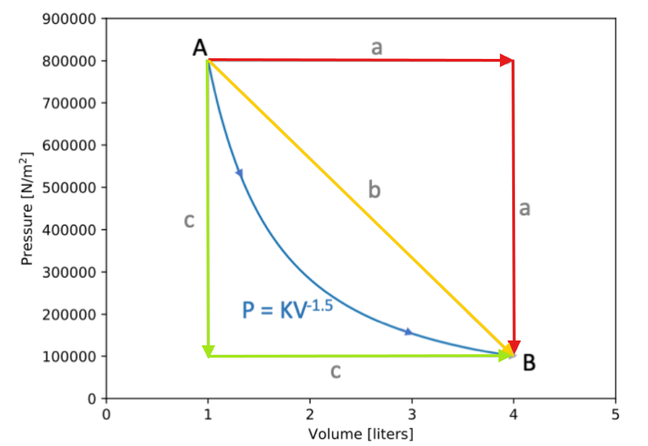
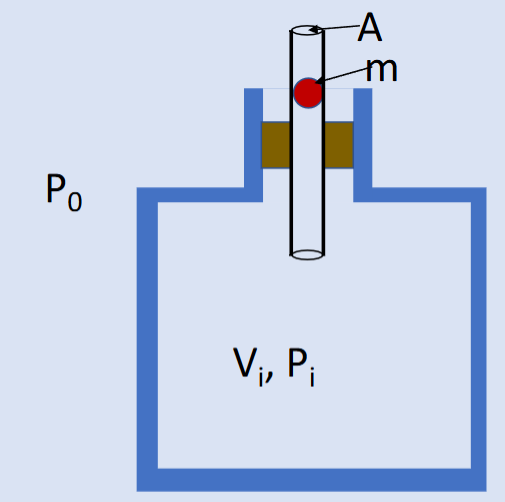

# ENPH 372 -- Assignment 1

Written by: Noah Warren

## Question 1

This question involves answering questions about a Galilean Water Thermometer which relies on bulbs with different densities floating or sinking depending on the density of the suspension liquid, which is dependent on temperature.

### 1.a

In part A we consider a Galilean Water Thermometer that is using ethanol as its suspension liquid. The following characteristics are known about ethanol at 20°C.

| Property | Value |
| -------- | ------- |
| $\beta$  | $0.00112 \ K^{-1}$|
| $\rho$ | $0.7892 \ g \ cm^{-3}$|

The first question we are asked to consider is what density the glass bulb which represents 25°C would need to be. The key here is that the density of the ethanol will change as its temperature increases. Once we know what this density will be for 25°C we can make the density of the glass bulb ever so slightly more dense than the ethanol and that means the bulb will sink when the temperature is at or greater than 25°C.

To do this calculation, we know that $\beta$ is defined as the fractional change in volume per unit temperature.

$$
\beta = \frac{\Delta V / V}{\Delta T}
$$

Since we are given the density at 20°, we can use this coefficient to calculate the density at 25°C. To determine the density, we divide the initial density of the ethanol by the fractional change in density for the given temperature change.

$$
\begin{align}
\rho_{25°C} &= \frac{\rho_{20°C}}{1 + \beta \Delta T} \nonumber \\
            &= \frac{0.7892}{1 + 0.00112 (25 - 20)} \nonumber \\
            &= 0.7892 \ g \ cm^{-3} \nonumber
\end{align}
$$

If we picked the density of our bulb to be exactly that of the ethanol it would be neutrally buoyant and therefore not sink right at 25°C. To make it sink right at 25°, we would need to set the density of the bulb to be an infinitesimally small amount more dense than the ethanol. In practice this is almost surely impossible, and variations in manufacturing would cause the density of these bulbs to not be extremely precise.

These calculations obviously only hold under the assumption that $\beta$ for ethanol is constant across all temperatures.

The next questions asks for this to calculation to be done at 15°C. The only notable different here is that we expect the ethanol to be more dense this time as it has grown colder.

$$
\begin{align}
\rho_{15°C} &= \frac{\rho_{20°C}}{1 + \beta \Delta T} \nonumber \\
            &= \frac{0.7892}{1 + 0.00112 (15 - 20)} \nonumber \\
            &= 0.7936 \ g \ cm^{-3}\nonumber
\end{align}
$$

Our assumption that the liquid should be more dense obviously was correct, and just like earlier, to have the bulb sink at 15°C, we should make it just ever so slightly more dense than the ethanol at 15°.

### 1.b

Water is abnormal in the fact that its thermal expansion coefficient changes with temperature, and actually ends up changing signs at 4°C. This means that the coefficient of expansion is positive for $T > 4°C$ and negative for $T < 4°C$. This phenomena though actually is essential for the survival of our lake ecosystems as it allows fish and plants to access liquid water and live beneath the frozen surface of a lake in colder climates.

The reason this happens is that since the coefficient of water is negative below 4°C, colder water will actually start to float on top of warmer water. This means all the 4°C water sinks to the bottom of the lake, and all the water cold enough to freeze (<0°C) sits on top of the lake. If water continued to more dense as it fell below 0°C, all the cold water would sink to the bottom of the lake and the lake would freeze from the bottom up. This would be devastating to any ecosystems in the lake.

The freezing of a seabed is actually possible to see under certain hyper-specific conditions in regions of the antarctic. Streams of extremely cold and salty water entering the ocean can grow tendrils of ice called brinicles which extend down to the floor of the ocean and can form ice on the sea floor. This occurs when the stream of water coming in contains a lot of salt, greatly increasing its density and making it sink in the surrounding less dense water. Although not possible in freshwater, these brinicles are a cool example of a cooler dense liquid sinking through the surrounding liquid.

See an article and video on brinicles [here](https://eartharchives.org/articles/brinicle-ice-finger-of-death-filmed-in-antarctic/index.html).

## Question 2

### Part 2.a

We are asked to prove that the number of molecules that collides with a small area on the inside of a container wall is given by the expression:

$$
N_{collisions} = \frac{PA}{2m \overline v_x} \Delta t
$$

First lets consider which particles are actually eligible to run into the surface in the specified time frame. In one dimension, the only particles that will collide with the surface are those that are within the region of the x-axis contained by $v_x \times \Delta t$, as these particles will have the time to travel from their current position, to the wall in the given period. Taking this to three dimensions, we can simply multiply our x region by the surface area of the section of the wall to determine the "effective volume" containing particles that are actually eligible to hit the area.

$$
V_{eff} = \overline v_x \Delta t A
$$

If we now assume that the velocities of each gas particle are evenly distributed velocity (isotropic) we can recognize that at any given moment, only half of the particles in our volume are actually traveling towards the wall. This means that to get the number of molecules in our eligible volume, we must multiple by the density of particles ($n$) and divide by two.

$$
N_{collisions} = \frac{1}{2} n A \overline v_x \Delta t
$$

Now we just need to determine the particle density of the gas we are containing. From *Equation 1.14* in Schroeder, since $n = N/V$, we can come up with the following equation.

$$
P = n m \overline {v_x^2}
$$

This equation can then be arranged to solve for the gas particle density.

$$
n = \frac{P}{m \overline {v_x^2}}
$$

If we now sub this back into our equation for the number of solutions, we get the original equation:

$$
\begin{align}
N_{collisions} &= \frac{1}{2} n A \overline v_x \Delta t \nonumber \\
N_{collisions} &= \frac{1}{2} (\frac{P}{m \overline {v_x^2}}) A \overline v_x \Delta t \nonumber \\
N_{collisions} &= \frac{PA}{2m \overline v_x} \Delta t \nonumber
\end{align}
$$

### Part 2.b

It is trivial to answer this question if we simply say that from *Equation 1.15* in Schroeder we can rearrange to solve for $\overline {v_x^2}$ and take the square root.

$$
\begin{align}
kT &= m \overline {v_x^2} \nonumber \\
\overline {v_x^2} &= \frac{kT}{m} \nonumber \\
\sqrt{\overline {v_x^2}} &= \sqrt{\frac{kT}{m}} \nonumber
\end{align}
$$

### Part 2.c

To detemine $\frac{dN}{dt}$, we need to look at the number of particles leaving through the hole that we've made. We will start from our equation derived earlier for the number of collisions.

$$
N_{collisions} = \frac{1}{2} n A \overline v_x \Delta t
$$

Now we make the observation that the particle density of the gas is simply the number of particles per unit volume, or:

$$
n = \frac{N}{V}
$$

And if we use the approximation $\sqrt{\overline {v_x^2}} \approx \overline {v_x}$ from page 13 of Schroeder which recognizes that $v_{rms}$ is only marginally larger than $\overline v$, we can sub our answer from part B into the above equation and take the derivative with respects to time to get our answer.

$$
\begin{align}
N &= \frac{1}{2} \frac{N}{V} A \sqrt{\frac{kT}{m}} \Delta t \nonumber \\
\frac{dN}{dt} &=  - \frac{A}{2V} \sqrt{\frac{kT}{m}} N \nonumber
\end{align}
$$

Note that our answer is negative as the particles are leaving the container.

To solve this differential equation, lets first define a constant $\lambda$ which we will replace all of our constants with.

$$
\lambda = \frac{A}{2V} \sqrt{\frac{kT}{m}}
$$

Which gives our first order differential equation the form:

$$
\frac{dN}{dt} = -\lambda N
$$

Solving this ODE is really simple as it is separable, so all we need to do is isolate our two variables (t and N) and integrate both sides and isolate for N.

$$
\begin{align}
\int \frac{1}{N} dN &= \int -\lambda dt \nonumber \\
\ln N &= -\lambda t + C \nonumber \\
N &= e^C e^{-\lambda t} \nonumber
\end{align}
$$

Since we know this solution must satisfy the solution:

$$
N(t) = N(0)e^{\frac{-t}{\tau}}
$$

Then we can see that $e^C = N(0)$ and $\tau = \frac{1}{\lambda}$. $\frac{1}{\tau}$ is evidently just
equal to $\lambda = \frac{A}{2V} \sqrt{\frac{kT}{m}}$

### Part 2.d

This question requires some assumptions to be made. The main one is when is a tire considered flat? Since this is a model relying on exponential decay, we know we will never actually hit 0 pressure in the tire. For my answer, I'm going to consider the tire flat when it has **<80%** of its starting air leftover in it. This is a bit of an arbitrary choice but this estimation was made from intuition on the many times I've pumped up a bike tire. When you are sitting on the bike it doesn't take that much less than maximum pressure to make your tires unusable!

Next we will need to pick a value for the volume of a tire. Online I found that a typical 700cc road bike has a volume of around 1L ([link](https://www.quora.com/What-is-the-volume-of-air-in-a-bicycle-tire)) so I will use that approximation.

We also need to make an assumption on the mass of our gas particles, which we will say are all gaseous Nitrogen (N2), as well as the temperature of our surrounding air, which we will put at 300K (it must be a nice sunny day if we're going biking!).

Since we put our "flat percentage" at 80%, we care when the exponential term in our equation hits 0.8. This can then be solved to determine $A$ the size of the hole in the tire.

$$
\begin{align}
0.8 &= e^{-t\frac{A}{2V} \sqrt{\frac{kT}{m}}} \nonumber \\
\ln 0.8 &= -t\frac{A}{2V} \sqrt{\frac{kT}{m}} \nonumber \\
A &= \frac{-2V \ln (0.8)}{t} \sqrt{\frac{m}{kT}}\nonumber \\
\end{align}
$$

Now if we take $t = 1hr = 3600s$, and $m = 28.02 \frac{g}{mol}$ (the atomic mass of N2) we can solve for the area of the hole in the tire.

$$
\begin{align}
A &= \frac{-2 (1 \times 10^{-3} m^3) \ln (0.8)}{3600s} \sqrt{\frac{(28.02 \times 10^{-3} \frac{kg}{mol})/(6.022 \times 10^{23} \frac{molecules}{mol})}{(1.38 \times 10^{-23} \frac{J}{K}) 300K}}\nonumber \\
A &= 4.16 \times 10^{-10} m^2 = 4.16 \times 10^{-4} mm^2\nonumber
\end{align}
$$

The hole is obviously quite small, which makes sense if we use our intuition for how long the tire stayed inflated.

## Question 3

### Part 3.a

Water has nine degrees of freedom. The standard three from translation, it has no axis of rotational symmetry so three from rotation, and then another three vibrational modes. Two of the vibrational modes present are the lateral ones between the Hydrogen and Oxygen atoms, and the final is from angular vibration (bending) between the hydrogen atoms.

### Part 3.b

The heat capacity at constant volume for a gas, $C_v$, is simply $\frac{dU}{dT}$. Using the equipartition theorem then we can write the following.

$$
\begin{align}
\Delta U &= N f \frac{1}{2}k \Delta T \nonumber \\
f &= \frac{2 \Delta U}{N k \Delta T} \nonumber \\
f &= \frac{2 C_v}{N k} \nonumber
\end{align}
$$

Since we are given the amount of energy required to heat one gram of water by 1 degree we know the value of our specific heat capacity. The molar mass of water is also a known quantity ($18.02 \frac{g}{mol}$), so we are able to calculate N, the number of molecules in the 1g sample.

$$
N = 1 g \times \frac{1}{18} \frac{mol}{gram} \times 6.022\times10^{23} \frac{molecules}{mol}
$$

Now combining it all we can estimate the degrees of freedom present in the water.

$$
\begin{align}
f &= \frac{2 C_v}{N k} \nonumber \\
f &= \frac{2 (1.4 \frac{J}{g K})}{(1 g \times \frac{1}{18} \frac{mol}{gram} \times 6.022\times10^{23} \frac{molecules}{mol})(1.38 \times 10^{-23} \frac{J}{K})} \nonumber \\
f &= 6.06 \approx 6 \nonumber
\end{align}
$$

Here we find that there are only six degrees of freedom out of the nine possible ones for water active. This means that the higher energy modes, the vibrational ones, are likely to be frozen out. To access these degrees of freedom the heat energy of the water vapour would have to increase significantly.

### Part 3.c

For part one of this question we use the same equation as in part B, albeit cautiously as we know that the equipartition theorem doesn't lend itself very well to working with most liquids.

$$
\begin{align}
f &= \frac{2 C_v}{N k} \nonumber \\
f &= \frac{2 (4.2 \frac{J}{g K})}{(1 g \times \frac{1}{18} \frac{mol}{gram} \times 6.022\times10^{23} \frac{molecules}{mol})(1.38 \times 10^{-23} \frac{J}{K})} \nonumber \\
f &= 18.19 \nonumber
\end{align}
$$

Considering the fact that we determined that water has nine possible degrees of freedom, it is obvious that the equipartition theorem does not hold when dealing with liquid water. What we can gather from this calculation however is that the liquid water has a significantly higher heat capacity than in its vapour form. This is of course also visible from looking purely at their relative heat capacities, but if we are continuing along the degree of freedom standpoint, liquid water should have many more degrees of freedom than it does for it to be able to hold this much energy.

The obviously begs the question then of where this energy is going? The answer to this question can be found in the fundamental differences between liquids and solids. For the ideal gas model, we assume zero interaction between the different gas particles and therefore all the energy must be contained within each individual molecule. For liquids however we know that this isn't true and that there are indeed intermolecular forces that play significant roles. These forces, particularly hydrogen bonding in water, are responsible for maintaining the liquid state and serve as an additional vice for energy storage in a liquid. Water’s strong hydrogen bonds, formed due to its abundance of hydrogen and oxygen atoms, require substantial energy to disrupt, contributing significantly to its high heat capacity

## Question 4

The process $a$, $b$, and $c$ are shown for an unknown non-ideal gas below.

In this plot, the gas constant can be calculated from any point on the PV curve. It is calculated below using point A

$$
\begin{align}
K &= \frac{P}{V^{-1.5}} \nonumber \\
K &= \frac{800000 \frac{N}{m^2}}{0.001^{-1.5} m^3} \nonumber \\
K &= 25.3 Nm^5 \nonumber
\end{align}
$$

Once we have K, we can use the integral law of thermodynamics to determine the change in energy between points A and B in the process.

$$
\begin{align}
\Delta U_{a-b} &= -\int_{V_A}^{V_B} P(V) dV \nonumber \\
         &= -\int_{0.001}^{0.004} (25.3) (V^{-1.5}) dV \nonumber \\
         &= -800 J \nonumber
\end{align}
$$

Since the change in thermal energy, is a conserved quantity regardless of the path taken between two events, we can use this value for $\Delta U$ across all processes outlined in the graph. energy is conserved in a PV diagram, the change in energy for energy process from point A to point B will therefore be constant at 800J.

### Process A

For process A we note that the gas is originally expanded at constant pressure, then pressure increases at constant volume

The work done in the first phase of process A is simply given by multiplying the change in volume by the pressure of the gas, the standard equation for work done by an expanding gas. In this case, the gas is expanding so the work done must be negative.

$$
\begin{align}
W &= - P \Delta V \nonumber \\
W &= -800000 \frac{N}{m^2} \times 0.003 m^3 \nonumber \\
W &= -2400 Nm \nonumber
\end{align}
$$

Since $\Delta U$ remains constant for all processes, we can now use the first law of thermodynamics to calculate the heat energy transfer of this process.

$$
\begin{align}
Q_A &= \Delta U - W \nonumber \\
  &= -800J - 2400J \nonumber \\
  &= -3200J \nonumber
\end{align}
$$

### Process B

Process B is a linear transition from point A to point B. The work done to expand this gas is given by the area under the line which can be calculated using the integral definition of work on a gas, or by simply using geometry.

$$
\begin{align}
W &= -(A_{triangle} + A_{rectangle}) \nonumber \\
W &= -(\frac{1}{2}(0.003 m^3)(700000 \frac{N}{m^2}) + (0.003 m^3)(100000 \frac{N}{m^2})) \nonumber \\
W &= -1350 J \nonumber
\end{align}
$$

Similarly to process A, the work done is negative as the gas is expanding. With the same method from process A we can now calculate the heat lost in process B.

$$
\begin{align}
Q_B &= -800J - 1350J \nonumber \\
  &= -2150J \nonumber
\end{align}
$$

### Process C

The pressure decreases with fixed volume for the first stage of this process. The work done in the second phase to expand the gas is given using the standard work formula.

$$
W = - P \Delta V = -100000 \frac{N}{m^2} \times 0.003 m^3 = -300 J \nonumber
$$

Once again we see that we can use the same method as before to determine the heat lost.

$$
\begin{align}
Q_C &= -800J - 300J \nonumber \\
  &= -1100J \nonumber
\end{align}
$$

From these answers, we can draw the conclusion that for the most efficient transfer of heat out of a gas, the gas should be expanded at high pressures then drop the pressure. This makes for the greatest loss of thermal energy from the gas.

## Question 5

Question 5 concerns the physical system shown below.

To analyze the system shown below, we first note that the pressure inside the chamber will be marginally higher than the pressure outside of it due to the force of gravity pulling the ball down. This can be represented by the equation below.

$$
P_i = P_0 + \frac{mg}{A}
$$

### Part A

As a part of this question, we are told to assume that any compression is adiabatic. This makes sense as there is really no way the ball could ever be moving fast enough that the molecules can't move out of the way simply due to gravity.

Since our compression is adiabatic we know that the product of the pressure and volume raised to the adiabatic index must remain constant.

$$
V^{\gamma} P = constant
$$

When the ball falls into the tube, it is displacing an amount of air greater than at rest who's volume is given by the area of the tube multiplied by the depth the ball has fallen, taking up as positive and down as negative. We can represent this as the following.

$$
V_f = V_i + A \Delta x
$$

Now taking advantage of the relation of pressure and volume for adiabatic processes, we can come up for a model for the pressure inside the container with respects to the displacement of the ball.

$$
\begin{align}
P V^\gamma &= P_i V_i^\gamma \nonumber \\
P (V_i + Ax)^\gamma &= (P_i + \frac{mg}{A}) V_i^\gamma \nonumber \\
P &= (P_i + \frac{mg}{A}) \left(\frac{V_i}{V_i + Ax}\right) ^\gamma \nonumber
\end{align}
$$

### Part B

We now consider the situation where the ball is undergoing SHM due to the pressure increase of it falling into the chamber counteracting th gravitational force acting on the ball. To maintain these conditions indefinitely we need to assume the system is frictionless and there is no gas leakage around the ball.

From our equation above for pressure, we can consider the inverse of the volume term and come up with an approximation that makes doing the math significantly easier for this system.

$$
\begin{align}
\left(\frac{V_i}{V_i + Ax}\right) ^\gamma &= \left(\frac{V_i + Ax}{V_i}\right) ^{-\gamma} \nonumber \\
&= \left(1 + \frac{Ax}{V_i}\right) ^{-\gamma} \nonumber \\
&\approx 1 - \gamma \frac{Ax}{V_i} \nonumber
\end{align}
$$

If we now consider the force on the ball caused by this pressure differential, we can come up with an equation for the net force on the object that is in a form that is common for a simple harmonic oscillator and will allow us to model the ball's motion.

$$
\begin{align}
F &= (P - P_0)A \nonumber \\
&= A[(P_0 + \frac{mg}{A})(1-\gamma \frac{Ax}{V_i}) - P_0] \nonumber \\
&= A[- \frac{P_0 \gamma Ax}{V_i} + \frac{mg}{A}(1 - \gamma \frac{Ax}{V_i})] \nonumber \\
&= mg - \left(\frac{mg \gamma A}{V_i} + \frac{P_0 \gamma A^2}{V_I}\right) x \nonumber \\
\end{align}
$$

For a standard simple harmonic oscillator, this second term is commonly referred to as the restoring force, where the constant out front is denoted as k.

$$
k = \frac{mg \gamma A}{V_i} + \frac{P_0 \gamma A^2}{V_I}
$$

Now we can use the general form of a simple harmonic oscillator to determine the period of the oscillations of the ball in the tube.

$$
\begin{align}
m \ddot x &= -kx \nonumber \\
m \ddot x &= \left(\frac{mg \gamma A}{V_i} + \frac{P_0 \gamma A^2}{V_I}\right) x \nonumber \\
\ddot x & = \left(\frac{g \gamma A}{V_i} + \frac{P_0 \gamma A^2}{m V_I}\right) x \nonumber \\
\end{align}
$$

For a simple harmonic oscillator, the angular frequency is a very well defined quantity that can be calculated with the expression $\omega = \sqrt{\frac{k}{m}}$, and then we can calculate the period of the oscillations with the expression $\tau = \frac{2 \pi}{\omega}$. First lets calculate $\omega$.

$$
\begin{align}
\omega &= \sqrt{\frac{k}{m}} \nonumber \\
&= \sqrt{\frac{\frac{mg \gamma A}{V_i} + \frac{P_0 \gamma A^2}{V_I}}{m}} \nonumber \\
&= \sqrt{\frac{\gamma A^2 (P_0 + \frac{mg}{A})}{m V_i}} \nonumber \\
&= \sqrt{\frac{\gamma A^2 P_i}{m V_i}}
\end{align}
$$

With this definition, we can now come up with an expression for the period of the ball's oscillations.

$$
\begin{align}
\tau &= \frac{2 \pi}{\omega} \nonumber \\
&= 2 \pi \sqrt{\frac{m V_i}{\gamma A^2 P_i}} \nonumber \\
\end{align}
$$

And this is the final expression for the period of oscillation of the ball.
